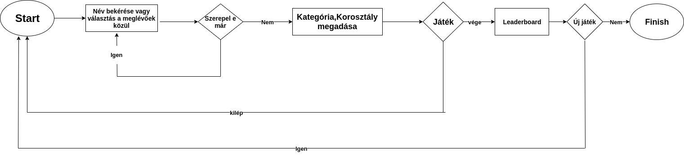
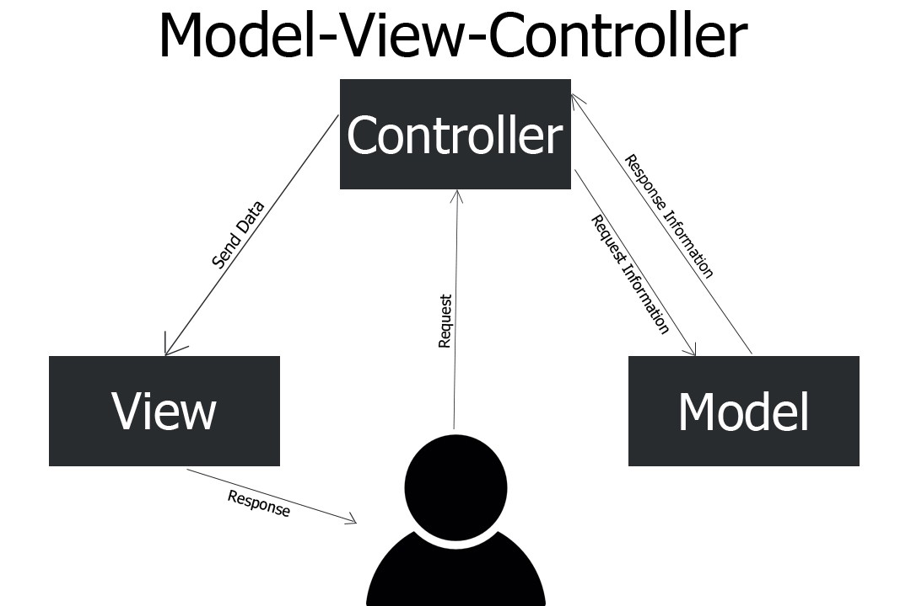
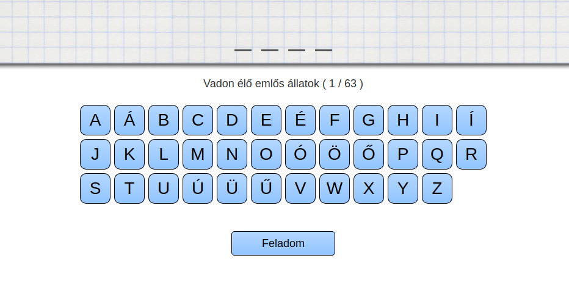
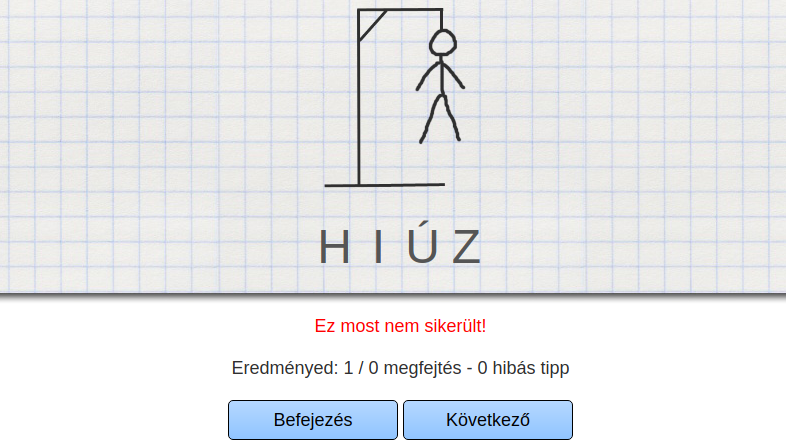

# Rendszerterv
## Bevezetés
Mai rohanó és fejlett világunkban az emberek többségében teljesen megváltoztak
 azon értékrendek, hogy mit tartanak fontosnak és mire tekintenek úgy,
 mintha nem is létezne. Születésünktől fogva a legtöbbünk célja az, hogy 
 már 20 és 30 éves korunkra saját autóval, házzal, modell barátnővel és 
 luxusjachtokkal rendelkezzünk egyben elérve az anyagi függetlenséget is.
 Az ilyen emberek fejében nagyon erős az a fajta céltudatosság és magamutogatás,
  hogy ezt a külvilág tudta nélkül elérni szinte lehetetlen.
 Osztogatják a saját tippjeiket a meggazdagosághoz vezető úthoz, ezáltal
  a szegényebb rétegtől megvonva azt a kevés pénzt is, amivel rendelkeznek,
   mivel ezek a tippek sosem ingyenesek.
 Ezt látva a mi csapatunk gondolt egyet és merészet, és a falvakban élő
  szegényebb réteg számára nyújtana egy új szórakozási lehetőséget, leváltva
   a régi papír és toll alapú változatot.
 A csapat és a program célja, hogy sorra járjuk falvakat, és néhány szegényebb
  családnak készítünk offline számítógépes programokat.
 A gépeket és a hozzá való eszközöket az önkormányzat biztosította a családok számára.
 Az első szerencsések között van e akasztófa játék megrendelője is.
## A rendszer célja
A rendszer célja, hogy az újonnan beütött világjárvány (amit csak COVID-19-ként
emlegetnek) miatt az életünk teljesen megváltozott. Kiszámíthatalan, hogy
mikor hoznak újabb, az év elejihez hasonló rendeletet, amivel korlátozzák
az emberek mozgását, vagy akár az egész országot bezárják. Ilyen helyzetben
a legfőbb cél az alkalmazkodás, az előre felkészülés, és picit a jövőbe
látás is. A fuvarozó cégek sem úgy teljesítenek a járvány miatt, ahogy
előtte, így a papír és toll ellátás sem biztosított már annyira, nem 
beszélve az inflációról. Ezáltal a mi rendszerünk célja régi papír és
toll alapú játékok modernizálása, mivel amúgy is mindenki otthonról
dolgozik, az ilyesfajta programokkal pedig a gyerekeket le lehet foglalni,
míg a szülő letölti a 8 - 10 órás munkaidejét home officeban. Nem is beszélve
arról, hogy védve a földet a fölösleges papírfelhasználástól, és szokatva az 
időseket, fiatalokat egyaránt a számítógéphez. A programunk egy JavaFX
felhasználói felülettel és SQL adatbázis rendszerrel fog működni.
## A project tervezete
A szoftver egy offline működő akasztófa játék lesz. Megalkotáskor céljaink
között szerepelt, hogy a program Linux és szintúgy Windows rendszereken
is probléma nélkül fusson.A megrendelő a gépe hardver specifikációi is
tudomásunkra adta, miszerint összesen 4GB DDR4-es memória, AMD FX-8120 3.1GHz
típusú processzorból, AMD Radeon R9 270X videókártyából áll, viszont az
internetelérés még nem biztosított. Az adattárolás egy H2 adatbázis
fogja biztosítani. Itt tárolódik majd a leaderboard, a korosztály és
kategória kiválasztásához szükséges adatok. A rendszer eleinte mivel még
csak béta verzióban fog működni, nem fog tartalmazni különösebb biztonsági
megoldásokat, ezért a játék indulásakor még csak egy felhasználónévvel
azonosítjuk magunkat. A rendszer a későbbiekben különböző támogatásokra,
és fejlesztésekre szorul, amit havonta fogunk elvégezni rajta.
## A rendszer felépítése
Az adatbázis kapcsolathoz szükséges egy adatbázis connection osztály,
amely létrehozza, fenntartja, és zárja az adatbáziskapcsolatot.
A felhasználóval való kommunikációt javafx-ben íródott interface valósítja
meg, ezek praktikusan külső fájlokból, és forrásból módosított részekből
állnak.
Az adatbázis három lényeges táblája a korosztály, a kategória és a user
tábla lesz.A korosztály és a kategória tábla közti kapcsolatot egy másik,
táblával, egy kapcsolótáblával oldottuk meg. Ez a tábla az általunk az
adatbázisba bevitt szavakat fogja tárolni, és hogy kiszűrjük, hogy egy
szó egy játékosnál csak egyszer szerepeljen, erre hoztuk létre a táblában
a hasznalt boolean típust. Ez majd True-ra vált minden olyan szó mellett,
amelyet már megpróbáltuk kitalálni, függetlenül attól, hogy az eltalálás
sikeres volt e vagy nem. A korosztály táblában lévő leírás szolgál majd
a 3 korosztálytípus, fiatal, középkorú és idős tárolására. A kategória
táblában szereplő névben lesznek tárolva a kategóriák nevei. Az utolsó táblában,
a userben pedig a leaderboardhoz szükséges adatokat fogjuk eltárolni.
A játék végén lesz ez megtekinthető, mégpedig a névben a már megadott
összes játékos neve mellett a játszott és nyert menetek számát láthatjuk majd.
A kezdetekben a kategóriák száma és a tartalmazott szavak limitáltak 
lesznek, ez a jövőben egy továbbfejleszthető opcióként tartjuk számon,
függően az érdeklődéstől.

A program controller részének megvalósítását Java programozási nyelven terveztük el.
A projekthez továbbá felhasználtuk a Maven nevű projekt menedzsment eszköztárat is.

Szavak               |   User              |   Kategória   | Korosztaly
---------------------|---------------------|---------------|-----
ID primary key       | ID primary key      | ID primary key| ID primary key
fk_korosztaly INTEGER| nev VARCHAR         |neve VARCHAR   | leiras VARCHAR
fk_kategoria INTEGER | jatszott INTEGER    |
szo VARCHAR          | nyert INTEGER       |
hasznalt BOOLEAN     |

## Projectmunkások és felelősségeik

A projektek négy személy készítette aki teljesen azonos pozícióban szerepelnek. 

Név                  |   Pozíció         
---------------------|------
Udvardy Marton       | Szoftverfejlesztő     
Szűcs Levente        | Szoftverfejlesztő       
Antal Balázs         | Szoftverfejlesztő   
Nagy Martin          | Szoftverfejlesztő      

## Ütemterv

 * 2020.09.07 (Hétfő) - 2020.09.14 (Hétfő) között kell elkezdezni és befejezni a Követelmény Specifikációnak részt.
 
 * 2020.09.14 (Hétfő) - 2020.09.21 (Hétfő) között kell kész lennie a Funkcionális Specifikációnak és a Rendszertervnek
 
 * 2020.09.21 (Hétfő) - 2020.10.05 (Hétfő) között kell elkezdeni illetve befejezni a programot, ez idő alatt kell a teszteket végrehajtani.
 
 * 2020.10.05 (Hétfő) - Program bemutatás, kiértékelése.
 
## Mérföldkövek
A program elkészítésének főbb mérföldkövei:
* A Trelloban való regisztráció, illetve ismerkedés a használatával
* Githubon a git repository elkészítése
* A tagok hozzárendelése git-hez és a trello-hoz
* A követelmény specifikáció megírása
* A funkcionális specifikáció megírása
* A rendszerterv megírása
* A program fejlesztésének megkezdése
* A program JavaFX UI-jának elkészítése
* A program adatbázisának elkészítése
* A program controllerének elkészítése
* A program tesztelése
* A program bemutatása
## Üzleti szereplők

A célközönség akik ezzel a játékkal fognak játszani az internet nélkül maradt gyerekek, akik szeretnék kipróbálni az akasztófa játékot egy számítógépen.
Természetesen ha egy adott gépen már telepítve van a program ott már egyéb barátok,ismerősök is tudnak rajta játszani.
Nem csak gyerekek játszhatnak hanem akár felnőttek is vele, korhatár nélküli a játék szóval bárki aki késztetést érez affelől, hogy játszon egy jót.

## Üzleti folyamatok

Maga a folyamat igen egyszerű és nem túl komplikált.

 * Játék feltelepítése .
 
 * Játék elindítása.
 
 * Első ablakban kapni fogunk egy kis rublikát amibe a felhasználónevünket írjuk be, például : Martin97.
 
 * Második ablakba két dolgot tudunk kiválasztani.
    * Korosztály : Fiatal, középkorú, idős.
    * Kategória  : Madár,tárgy stb..

 * Kezdődik a játék, a cél, hogy kitaláljuk a keresett szót.
 
 * Nyerés vagy vesztéstől függetlenül :
   * Vissza lehet térni a játék elejére és újrapróbálkozni.
   * Megnézni a ranglistát.

## Üzleti entitások

* Az üzletben résztvevő entitások:
  * A programmal játszó felhasználók
  * Olyan felhasználó aki már játszott a programmal és a neve már az eredménylistában szerpel
  * Olyan felhasználó aki még nem játszik, de majd később fog.
 
## Követelmények

A program célja a klasszikus papír alapú akasztófa játék leváltása. A jelenlegi papír-ceruza segítségével játszott játék digitalizálása.
Mindezt egy egyszerűbb, modernebb kezelhetőség érdekében, valamint a környezettudatosság nevében.
Célja az idő és energia, valamint a belefektetett pénz megspórolása, valamint a járvány ideje alatt arra is tekintettel voltunk, hogy ne kelljen a játékhoz elhagyni otthonunk.

## Funkcionális követelmények

* Mindenki számára könnyen és egyszerűen kezelhető program.
* Jól átlátható, letisztult felhasználói felület.
* Jól átlátható adatbázis kezelés.
* Egyszerű lekérdezések lebonyolítása.
* Könnyed adatfelvétel és módosítás.

## Nem funkcionális követelmények

* Esztétikus felhasználói felület.
* Látáskárosultak számára is megfelelő színvilág és betűméretek használata.

## Funkcionális terv

* A program célja, hogy az egyke gyerekek, vagy az olyan személyek akiknek nincsenek barátik, vagy az internettel nem rendelkezők is ki tudják próbálni a játékot.
* A jelenleg ismert játék felületének egy modernizált, gépi változatának létrehozása.

## Rendszerszereplők
A jelenlegi rendszerben a rendszerszereplők nem mások, mint a rendszer
használói vagyis a userek. A játék során limitált lehetőségük van, de később
ez bővítésre kerül. Egy user indítás után tud saját nevet megadni, kategóriát
és korosztályt választani. Lehetősége van a játék közben bizonyos hibázásra,
amit a rendszer észlel és jelez. Valamint egy leaderboardban tárolódnak
az eredményeik, ami minden játék végén megtekinthető. 
## Rendszerhasználati esetek és lefutásaik

## Fizikai környezet

* AMD FX-8120 processzor
* 4GB DDR4 memória
* Radeon R9 270X videokártya
* 1GB szabad tárhely

## Fejlesztői eszközök
A project során a következőket fogjuk használni:
* Java
* Maven
* SQL
## Keretrendszer
* Java FX
## Architekturális terv
## Egy architekturális tervezési minta
A projekt során az MVC (model-view-control) modellt fogjuk alkalmazni.

**Modell**:

## Az alkalmazás rétegei, fő komponensei, ezek kapcsolatai

* A szoftverünk megvalósítása az MVC, magyarul MNV azaz a Modell-Nézet-Vezérlő elveit fogja követni.

* Az alkalmazásunkat több rétegre bontjuk fel, ami a következő: 
  * megjelenítés 
  * felhasználói felület
  * logika
 
 * A megjelenítés az amit a szoftvert használók ténylegesen látnak az alkalmazásból.
 
 * Felhasználói felület amivel a szoftver és a felhasználó "kommunikál".
 Ez az amivel írányítjuk a "lépéseinket".
  
  * A logika az ami a felhasználó által véghezvitt eseményeket, műveleteket dolgozza fel,
   ami kiválthat további eseménysorozatot, illetve áll a tárolt adatok kezelésével.

* Azzal, hogy ezt a megvalósítást választottuk nagyban megkönnyíti a munkánkat.
Ez azért van mert ezzel a kódunk sokkal átláthatóbb, nem lesz szerteágazó.

## Képernyőtervek

Számunkra a projekt kinézete mindenféleképpen elsőszámú prioritás.
A legfontosabb az, hogy a képernyőn lévő elemek ne legyenek összesűrítve.
A célunk az, hogy minél átláthatóbb és felhasználóbarát legyen.

* Ehhez a JavaFX eszközeit alkalmazzuk. Emellett a JavaFX-hez tartozó SceneBuilder is felhasználásra kerül.
Elsősorban azért, mert ez ismerős számunkra, de emellett azért is mert nem komplikált a használata Java mellett.

### Indítóablak

* Az alkalmazás először is egy indítóablakkal indul. A bejelentkező ablak tartalmaz egy bemeneti mezőt.
A bemeneti mezőben írjuk be a felhasználónevünket amelyet eltárolunk. 
Abban az esetben, ha nem írunk felhasználónevet, akkor a rendszer nem enged tovább.
 
 * Miután sikerült megadni a felhasználóneved, utána a program felkínálja a lehetőséget,hogy kiválaszd a korosztályt és a kitalálandó szókategóriáját.
 
 * Ezután tovább léphetünk a főjátékra. 

### Játékablak
 
 * A képernyő közepén majd láthatjuk a rublikákat amelyek a bizonyos szónak a betűit tárolja.
 A betűk az ablak alján helyezkednek el. Ha egy betűre rányomunk, akkor a rendszer ellenőrzi, hogy vajon a szót tartalmazza az a betű.
 Ha tartalmazza akkor a már említett rublikák helyére bekerül(nek) az adott betű. Ha nem tartalmazza akkor a hiba jelzésre kerül.
 A kattintás után az adott betű át lesz húzva és többet nem lehet felhasználni.

* Segítségünk nem lesz, csak saját magunkra leszünk utalva.
 
 * A játék lefolyása alatt a felhasználónak lehetősége van arra, hogy félbeszakítsa a játékot.
 
 * Ha a hibák összegyűlnek (11) akkor a játékos elveszíti a játékot. Ezután a program új játékra kéri fel a felhasználót.
 A hibázások után majd egy ábrát láthatunk, ami mindig frissülni fog, ha újra hibás betűt választunk.
 Ha újra játszani akar a felhasználó, akkor a program egy újabb szót választ ki.

### Eredménylista
 
 * Azonban ha a játékos nem akar többet játszani, akkor a program az eredménylistához vezet.
  Az eredménylistában láthatóak, majd a játékos neve, összes játékainak száma, a győzelmeinek száma.
  
 * Emellett lesz egy gomb ami visszavisz a játékba, ha a felhasználó újra játszani szeretne.
 
**Főablak**

**Elvesztett játék**

 
## Rendszer bővíthetősége

Természetesen a késöbbiekben bővíthető lesz a program.
A program fejlesztése és bővítése függeni fog a felhasználók számától illetve kérvényeiktől is.
Amennyiben jópár kérvény jön be egy-egy kérésről akkor fontolóra vesszük a játékba való beillesztését.
Nem csak javaslatokra hanem saját elképzeléseink hatására is lehetséges a bővítés.
Mivel ez egy jelenleg kiadott program lesz így lehetséges a korai frissítés.

## Biztonsági funkciók
A rendszer még a béta verzióban indul, így ehhez még biztonsági funkciót
nem tervezett a csapatunk. A későbbiekben a havonta elvégzendő tesztelések
és fejlesztések között, mint cél szerepel, hogy a játékot átírjuk online-ra
majd azon a felületen már felhasználónév és jelszó párosítással kelljen
belépni. A jelszavak természetesen itt már titkosítva lesznek, hogy
megelőzzük a különböző visszaéléseket. Annyit még megemlítenék, hogy 
a program készítése során a jobb kód reményében SonarLint-et alkalmazni fogunk.
## Adatbázis terv
A program adatbázisát 4 tábla alkotja:

Korosztály:
* ID
* leiras

Szavak:
* ID
* fk_korosztaly
* fk_kategoria
* szo
* hasznalt

Kategória:
* ID
* neve

User:
* ID
* nev
* jatszott
* nyert

**Modell:**

Szavak               |   User              |   Kategória   | Korosztaly
---------------------|---------------------|---------------|-----
ID primary key       | ID primary key      | ID primary key| ID primary key
fk_korosztaly INTEGER| nev VARCHAR         |neve VARCHAR   | leiras VARCHAR
fk_kategoria INTEGER | jatszott INTEGER    |
szo VARCHAR          | nyert INTEGER       |
hasznalt BOOLEAN     |
## Implementációs terv
A tervezési folyamatban célszerű az általános logikai felépítést mindig
 valamilyen grafikus reprezentációval modellezni, mert az emberi agy
 vizualizált objektumokkal könnyebben dolgozik. Az UML (=Unified Modeling Language),
 modellező nyelv segítségével a specifikációt és a tervezést is grafikus
 formában, diagramok segítségével tudjuk dokumentálni. A követelményspecifikációban
 a használati esetdiagramokat (use case), az adatbázis tervezésnél az adatbázis diagramot,
 az OOP tervezésnél az osztálydiagramot és objektumdiagramot valamint a szekvenciadiagramot,
 aktivitásdiagramot használhatjuk.
## Üzleti logika osztályai

* Az üzleti logika a háromrétegű adatkezelő alkalmazások középső rétege, amely meghatározza az alkalmazás működésének logikáját.
* A háromrétegű arhcitektúra az alkalmazást három különálló rétegre osztja fel.
* E rétegek komponensei önállóan léteznek és együttműködésük során egyidejűleg több különböző alkalmazásnak is a részei lehetnek.
* Az adatbázislogika az adatok nyers tárolását végzi.
* Semmilyen információval nem rendelkezik az adatok feldolgozásával vagy megjelenítésével kapcsolatban.
* Az ügyviteli (üzleti) logika az alkalmazás logikáját, működési szabályait határozza meg.
* Semmilyen információval nem rendelkezik az adatok tárolásával vagy megjelenítésével kapcsolatban.
* A felhasználói interfész feladata az ügyviteli logika által küldött adatok formázása és megjelenítése.
* Biztosítja a felhasználó hozzáférését az ügyviteli logika szolgáltatásaihoz.
* Sohasem kerül közvetlen kapcsolatba az adatbázissal és nem végez semmilyen műveletet az adatokon.

## Tesztterv

| Pontok | Leírás |
---------|---------
|01      | A program indítása |
|02      | A user nevének megadása |
|03      | Azonos név megadása, mivel egy név egyszer szerepelhet |
|04      | Korosztályok kiválasztása |
|05      | Kategóriák kiválasztása |
|06      | Billentyűzeten egy betű egyszer kattintható |
|07      | Egy betű megadásakor, mindenhova beíródik |
|08      | 11 hiba után megáll a játék |
|09      | Jól kirajzolódik a hiba ábra |
|10      | Játék bármikor megszakítható |
|11      | Játék végén leaderboard működik |
|12      | Játék végén újrakezdés működik |
|13      | Játék végén kilépés működik |