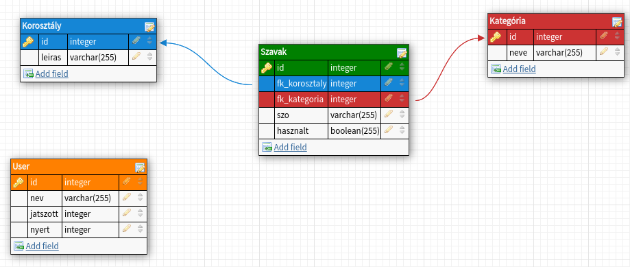

# Rendszerterv
## Bevezetés
Mai rohanó és fejlett világunkban az emberek többségében teljesen megváltoztak
 azon értékrendek, hogy mit tartanak fontosnak és mire tekintenek úgy,
 mintha nem is létezne. Születésünktől fogva a legtöbbünk célja az, hogy 
 már 20 és 30 éves korunkra saját autóval, házzal, modell barátnővel és 
 luxusjachtokkal rendelkezzünk egyben elérve az anyagi függetlenséget is.
 Az ilyen emberek fejében nagyon erős az a fajta céltudatosság és magamutogatás,
  hogy ezt a külvilág tudta nélkül elérni szinte lehetetlen.
 Osztogatják a saját tippjeiket a meggazdagosághoz vezető úthoz, ezáltal
  a szegényebb rétegtől megvonva azt a kevés pénzt is, amivel rendelkeznek,
   mivel ezek a tippek sosem ingyenesek.
 Ezt látva a mi csapatunk gondolt egyet és merészet, és a falvakban élő
  szegényebb réteg számára nyújtana egy új szórakozási lehetőséget, leváltva
   a régi papír és toll alapú változatot.
 A csapat és a program célja, hogy sorra járjuk falvakat, és néhány szegényebb
  családnak készítünk offline számítógépes programokat.
 A gépeket és a hozzá való eszközöket az önkormányzat biztosította a családok számára.
 Az első szerencsések között van e akasztófa játék megrendelője is.
## A rendszer célja
A rendszer célja, hogy az újonnan beütött világjárvány (amit csak COVID-19-ként
emlegetnek) miatt az életünk teljesen megváltozott. Kiszámíthatalan, hogy
mikor hoznak újabb, az év elejihez hasonló rendeletet, amivel korlátozzák
az emberek mozgását, vagy akár az egész országot bezárják. Ilyen helyzetben
a legfőbb cél az alkalmazkodás, az előre felkészülés, és picit a jövőbe
látás is. A fuvarozó cégek sem úgy teljesítenek a járvány miatt, ahogy
előtte, így a papír és toll ellátás sem biztosított már annyira, nem 
beszélve az inflációról. Ezáltal a mi rendszerünk célja régi papír és
toll alapú játékok modernizálása, mivel amúgy is mindenki otthonról
dolgozik, az ilyesfajta programokkal pedig a gyerekeket le lehet foglalni,
míg a szülő letölti a 8 - 10 órás munkaidejét home officeban. Nem is beszélve
arról, hogy védve a földet a fölösleges papírfelhasználástól, és szokatva az 
időseket, fiatalokat egyaránt a számítógéphez. A programunk egy JavaFX
felhasználói felülettel és SQL adatbázis rendszerrel fog működni.
## A project tervezete
A szoftver egy offline működő akasztófa játék lesz. Megalkotáskor céljaink
között szerepelt, hogy a program Linux és szintúgy Windows rendszereken
is probléma nélkül fusson.A megrendelő a gépe hardver specifikációi is
tudomásunkra adta, miszerint összesen 4GB DDR4-es memória, AMD FX-8120 3.1GHz
típusú processzorból, AMD Radeon R9 270X videókártyából áll, viszont az
internetelérés még nem biztosított. Az adattárolás egy H2 adatbázis
fogja biztosítani. Itt tárolódik majd a leaderboard, a korosztály és
kategória kiválasztásához szükséges adatok. A rendszer eleinte mivel még
csak béta verzióban fog működni, nem fog tartalmazni különösebb biztonsági
megoldásokat, ezért a játék indulásakor még csak egy felhasználónévvel
azonosítjuk magunkat. A rendszer a későbbiekben különböző támogatásokra,
és fejlesztésekre szorul, amit havonta fogunk elvégezni rajta.
## A rendszer felépítése
Az adatbázis kapcsolathoz szükséges egy adatbázis connection osztály,
amely létrehozza, fenntartja, és zárja az adatbáziskapcsolatot.
A felhasználóval való kommunikációt javafx-ben íródott interface valósítja
meg, ezek praktikusan külső fájlokból, és forrásból módosított részekből
állnak.
Az adatbázis három lényeges táblája a korosztály, a kategória és a user
tábla lesz.A korosztály és a kategória tábla közti kapcsolatot egy másik,
táblával, egy kapcsolótáblával oldottuk meg. Ez a tábla az általunk az
adatbázisba bevitt szavakat fogja tárolni, és hogy kiszűrjük, hogy egy
szó egy játékosnál csak egyszer szerepeljen, erre hoztuk létre a táblában
a hasznalt boolean típust. Ez majd True-ra vált minden olyan szó mellett,
amelyet már megpróbáltuk kitalálni, függetlenül attól, hogy az eltalálás
sikeres volt e vagy nem. A korosztály táblában lévő leírás szolgál majd
a 3 korosztálytípus, fiatal, középkorú és idős tárolására. A kategória
táblában szereplő névben lesznek tárolva a kategóriák nevei. Az utolsó táblában,
a userben pedig a leaderboardhoz szükséges adatokat fogjuk eltárolni.
A játék végén lesz ez megtekinthető, mégpedig a névben a már megadott
összes játékos neve mellett a játszott és nyert menetek számát láthatjuk majd.
A kezdetekben a kategóriák száma és a tartalmazott szavak limitáltak 
lesznek, ez a jövőben egy továbbfejleszthető opcióként tartjuk számon,
függően az érdeklődéstől.

A program controller részének megvalósítását Java programozási nyelven terveztük el.
A projekthez továbbá felhasználtuk a Maven nevű projekt menedzsment eszköztárat is.

Szavak               |   User              |   Kategória   | Korosztaly
---------------------|---------------------|---------------|-----
ID primary key       | ID primary key      | ID primary key| ID primary key
fk_korosztaly INTEGER| nev VARCHAR         |neve VARCHAR   | leiras VARCHAR
fk_kategoria INTEGER | jatszott INTEGER    |
szo VARCHAR          | nyert INTEGER       |
hasznalt BOOLEAN     |

## Projectmunkások és felelősségeik

A projektek négy személy készítette aki teljesen azonos pozícióban szerepelnek. 

Név                  |   Pozíció         
---------------------|------
Udvardy Marton       | Szoftverfejlesztő     
Szűcs Levente        | Szoftverfejlesztő       
Antal Balázs         | Szoftverfejlesztő   
Nagy Martin          | Szoftverfejlesztő      

## Ütemterv

 * 2020.09.07 (Hétfő) - 2020.09.14 (Hétfő) között kell elkezdezni és befejezni a Követelmény Specifikációnak részt.
 
 * 2020.09.14 (Hétfő) - 2020.09.21 (Hétfő) között kell kész lennie a Funkcionális Specifikációnak és a Rendszertervnek
 
 * 2020.09.21 (Hétfő) - 2020.10.05 (Hétfő) között kell elkezdeni illetve befejezni a programot, ez idő alatt kell a teszteket végrehajtani.
 
 * 2020.10.05 (Hétfő) - Program bemutatás, kiértékelése.
 
## Mérföldkövek
A program elkészítésének főbb mérföldkövei:
* A Trelloban való regisztráció, illetve ismerkedés a használatával
* Githubon a git repository elkészítése
* A tagok hozzárendelése git-hez és a trello-hoz
* A követelmény specifikáció megírása
* A funkcionális specifikáció megírása
* A rendszerterv megírása
* A program fejlesztésének megkezdése
* A program JavaFX UI-jának elkészítése
* A program adatbázisának elkészítése
* A program controllerének elkészítése
* A program tesztelése
* A program bemutatása
## Üzleti szereplők
## Üzleti folyamatok
## Üzleti entitások
## Követelmények

A program célja a klasszikus papír alapú akasztófa játék leváltása.

## Funkcionális követelmények
## Nem funkcionális követelmények
## Funkcionális terv
## Rendszerszereplők
## Rendszerhasználati esetek és lefutásaik
## Menü hierarchiák
## Fizikai környezet
## Fejlesztői eszközök
## Keretrendszer
## Architekturális terv
## Egy architekturális tervezési minta
## Az alkalmazás rétegei, fő komponensei, ezek kapcsolatai
## Rendszer bővíthetősége
## Biztonsági funkciók
A rendszer még a béta verzióban indul, így ehhez még biztonsági funkciót
nem tervezett a csapatunk. A későbbiekben a havonta elvégzendő tesztelések
és fejlesztések között, mint cél szerepel, hogy a játékot átírjuk online-ra
majd azon a felületen már felhasználónév és jelszó párosítással kelljen
belépni. A jelszavak természetesen itt már titkosítva lesznek, hogy
megelőzzük a különböző visszaéléseket. Annyit még megemlítenék, hogy 
a program készítése során a jobb kód reményében SonarLint-et alkalmazni fogunk.
## Adatbázis terv
A program adatbázisát 4 tábla alkotja:

Korosztály:
* ID
* leiras

Szavak:
* ID
* fk_korosztaly
* fk_kategoria
* szo
* hasznalt

Kategória:
* ID
* neve

User:
* ID
* nev
* jatszott
* nyert

**Modell:**

Szavak               |   User              |   Kategória   | Korosztaly
---------------------|---------------------|---------------|-----
ID primary key       | ID primary key      | ID primary key| ID primary key
fk_korosztaly INTEGER| nev VARCHAR         |neve VARCHAR   | leiras VARCHAR
fk_kategoria INTEGER | jatszott INTEGER    |
szo VARCHAR          | nyert INTEGER       |
hasznalt BOOLEAN     |
## Logikai adatmodell
## Implementációs terv
## Perzisztencia-osztályok
## Üzleti logika osztályai
## Tesztterv